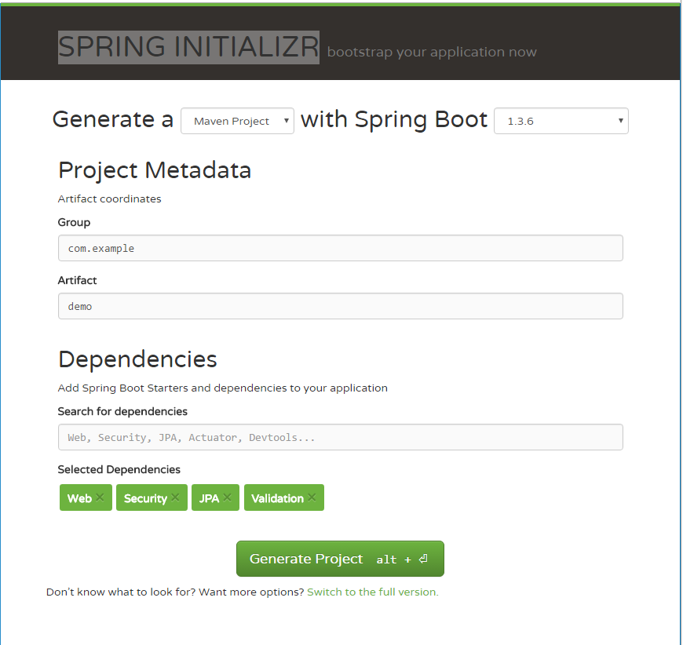

# Create project skeleton

[SPRING INITIALIZR](http://start.spring.io)提供了一个可视的 Web UI 来启动一个 Spring Boot 项目. 你可以选择将在您要创建的项目中添加 starter.

打开 [https://start.spring.io](https://start.spring.io), 在 **Dependencies** 输入框搜索 *Web*, *Secrity*, *JPA*, *Validation* ,选择下拉菜单中的项目.



然后按下 `ALT+Enter` 或单击 **Generate** 按钮将生成的代码下载到 zip 存档中.

将文件解压缩到本地系统中.

作为一个起点,它只包含几个文件.


* Maven 项目配置文件 *pom.xml*, 几个就像 Gradle wrapper 一样的 Maven 包装文件, 它用来为这个项目下载一个特定的 Maven.
* 一个特定的 `Application` 类作为应用程序 entry.
* 一个虚拟的测试 `Application` 类.

打开 *pom.xml* 文件, 如下:

```
<?xml version="1.0" encoding="UTF-8"?>
<project xmlns="http://maven.apache.org/POM/4.0.0" xmlns:xsi="http://www.w3.org/2001/XMLSchema-instance"
	xsi:schemaLocation="http://maven.apache.org/POM/4.0.0 http://maven.apache.org/xsd/maven-4.0.0.xsd">
	<modelVersion>4.0.0</modelVersion>

	<groupId>com.example</groupId>
	<artifactId>demo</artifactId>
	<version>0.0.1-SNAPSHOT</version>
	<packaging>jar</packaging>

	<name>demo</name>
	<description>Demo project for Spring Boot</description>

	<parent>
		<groupId>org.springframework.boot</groupId>
		<artifactId>spring-boot-starter-parent</artifactId>
		<version>1.3.6.RELEASE</version>
		<relativePath/> <!-- lookup parent from repository -->
	</parent>

	<properties>
		<project.build.sourceEncoding>UTF-8</project.build.sourceEncoding>
		<java.version>1.8</java.version>
	</properties>

	<dependencies>
		<dependency>
			<groupId>org.springframework.boot</groupId>
			<artifactId>spring-boot-starter-data-jpa</artifactId>
		</dependency>
		<dependency>
			<groupId>org.springframework.boot</groupId>
			<artifactId>spring-boot-starter-security</artifactId>
		</dependency>
		<dependency>
			<groupId>org.springframework.boot</groupId>
			<artifactId>spring-boot-starter-validation</artifactId>
		</dependency>
		<dependency>
			<groupId>org.springframework.boot</groupId>
			<artifactId>spring-boot-starter-web</artifactId>
		</dependency>
		
		<dependency>
			<groupId>org.springframework.boot</groupId>
			<artifactId>spring-boot-starter-test</artifactId>
			<scope>test</scope>
		</dependency>
	</dependencies>
	
	<build>
		<plugins>
			<plugin>
				<groupId>org.springframework.boot</groupId>
				<artifactId>spring-boot-maven-plugin</artifactId>
			</plugin>
		</plugins>
	</build>
</project>
```

* 包的类型是 **jar**, 这意味着它将在构建时包含嵌入的 tomcat. 你可以通过命令行 `java -jar app.jar` 启动应用程序.
* 父模块时 `spring-boot-starter-parent` 它是一个 BOM(Bill of material 物料清单) 包含 Spring Boot 依赖关系的声明. 只需在依赖关系节点下添加要使用的 `dependencies` 就行.
* 每个 starter 都会处理传递 dependencies. 除了我们选择的这些 starters , 它还包括一个测试目的的 starter , 它将增加流行的测试框架的依赖, 比如 *hamcrest*, *assertj*, *mockito* 等等.
* `spring-boot-maven-plugin` 允许您在嵌入式的 Tomcat 中运行项目.

另一个重要的文件是这个示例应用程序的入口类.

```
@SpringBootApplication
public class DemoApplication {

	public static void main(String[] args) {
		SpringApplication.run(DemoApplication.class, args);
	}
}
```

`@SpringBootApplication` 是一个元注释, 它是一个组合包括 `@EnableAutoConfiguration`, `@ComponentScan` 以及 `@SpringBootConfiguration`.

* `@EnableAutoConfiguration` 默认启用自动配置检测.
* `@SpringBootConfiguration` 类似于 `@Configuration`, 它表明应用程序是一个 Spring Boot 应用程序, 只允许一个 `@SpringBootConfiguration` 在一个应用程序中.
* `@ComponentScan` 定义了查找组件的范围, 默认情况下,如果不指定package, 它将扫描注解的类作为基础 package. 所以建议把 `Application` 放在根 package 中.

除此之外, 没有什么! 配置文件在哪里呢?

Spring Boot 内部使用了大量的自动配置机制来简化 Spring 开发人员的配置. 对于这个项目, 它默认配置一个简单的 BASIC 鉴定. 如果你添加 H2 数据库或者其他 JDBC 驱动, 它将自动配置数据源和事务管理器.

直到现在, 如果你在 `pom.xml` 中添加了一些依赖关系, 你现在就可以开始编写代码了. 这是快速方法去构建您的应用程序原型.

虽然 Spring Boot 提供了自动配置功能, 但它并不妨碍您自定义您的配置.

在 [示例代码] (https://github.com/hantsy/angularjs-springmvc-sample-boot) 中, 有一些自定义配置类.
